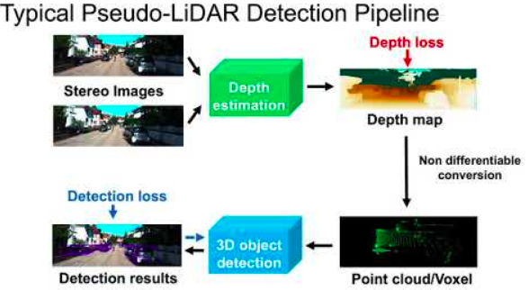
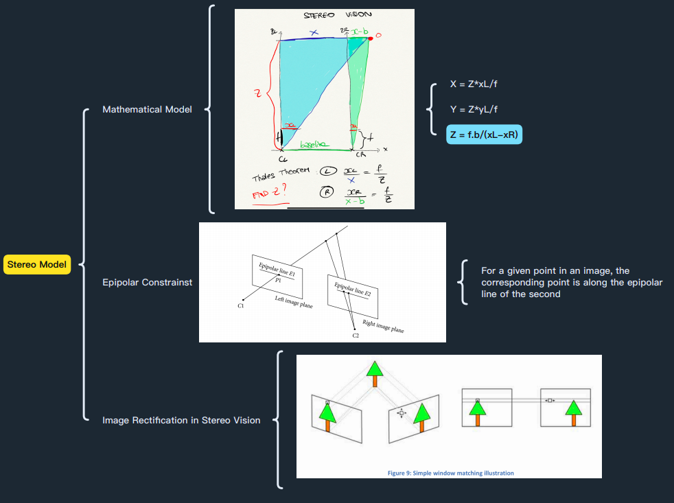
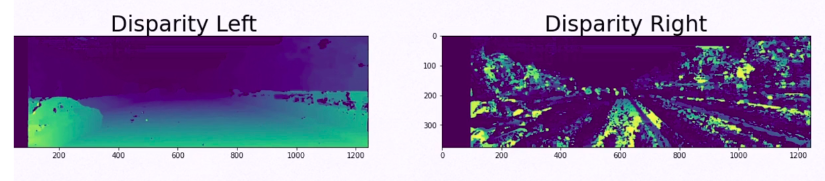
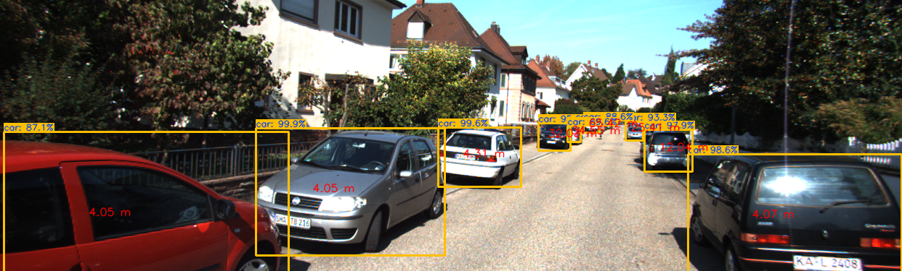

# Pseudo-LIDAR approach for 3D-Object detection
Deep Learning and Computer Vision have experienced tremendous growth in autonomous systems and are now widely utilized. Over the last decade, the field of computer vision has grown rapidly, particularly in the area of obstacle detection.
Obstacle detection techniques like YOLO or RetinaNet generate 2D Bounding Boxes that show where the obstacles are in the picture. The majority of object detection algorithms nowadays use monocular RGB cameras and are unable to report the distance between each obstacle.
Engineers combine the camera with LiDAR (Light Detection And Ranging) sensors, which employ laser to
provide depth information, to return the distance of each barrier. Sensor Fusion is used to combine the results of computer vision and LiDAR.The usage of a LiDAR, which is costly, is the flaw in this technique. Engineers employ a technique in which they position two cameras and use geometry to define the distance between each obstacle: That new arrangement is known as a Pseudo-LiDAR.

### How to achieve distance estimation using Stereo Vision?

* `Calibrate the 2 cameras (intrinsic and extrinsic calibration)`
* `Create an epipolar scheme`
* `Build a disparity map and then a depth map`

## 1. Camera Caliberation
Every camera needs calibration, converting a 3D point (world) with [X,Y,Z] coordinates to a 2D Pixel with [X,Y] coordinates.

* The conversion from World Coordinates to Camera Coordinates is called extrinsic calibration. The extrinsic parameters are called R (rotation matrix) and T (translation matrix).
* The conversion from Camera Coordinates to Pixel Coordinates is called intrinsic calibration. It requires inner values for the camera such as focal length, optical center, …
* The intrinsic parameter is a matrix we call K.

The K matrix is found through camera calibration.
Generally, we use a checkerboard and automatic algorithms to perform it. When we do it, we tell the algorithm that a point in the checkerboard (ex: 0,0,0) corresponds to a pixel in the image (ex: 545, 343).

## 2. Epipolar geometry?

Stereo vision is the process of determining depth from two pictures. Our vision is akin to that of two cameras. They can compute the difference between the two points of view and construct a distance estimation since they look at a picture from separate angles.

`Baseline: The distance between the two camera centers`
`Focal Length: Estimated through calibration, the distance between the image plane and the pinhole/lens`
`XL/XR: The location of the real-world point O in the left/right image`
`Z: The Distance of the obstacle (our goal)`

## 3. Disparity Map?
Disparity is the difference in image location of the same 3D point from 2 different camera angles.

We may calculate a disparity map for each picture in relation to the other image. We'll do the following:
1. Calculate the difference between the two pictures.
2. Decompose the projection matrices into the intrinsic camera matrix K and the extrinsics R, t.
3. Estimate depth based on the information obtained in the previous two stages.

## 4. Depth estimation and Object Detection
* Create a disparity map
* Use 3D Projections to estimate 3D coordinates of obstacles
* How to create a 3D Point Cloud from Stereo Images

1. There are 4 images: 3 coming from the KITTI VISION BENCHMARK SUITE and 1 coming from my own Stereo Camera.
2. Create a Disparity Map
3. Use the algorithms such as Stereo BM and Stereo SGBM to try and build a disparity map! Refer for [stereo matching algorithms](https://docs.google.com/viewerng/viewer?url=https://groups.csail.mit.edu/commit/papers/2016/min-zhang-meng-thesis.pdf)
4. Get the Calibration Parameters
5. Compute the Depth Map
6. Find Obstacles in 3D using 2D-to-3D converted bounding boxes

7. Use an obstacle detection algorithm and mix it with the depth map to get the distances of each obstacle.
8. Point-Cloud reconstruction from depth

* Refer for [stereo matching using deep learning](https://www.hindawi.com/journals/cin/2020/8562323/)
* [YOLOv4 weights](https://drive.google.com/file/d/1cewMfusmPjYWbrnuJRuKhPMwRe_b9PaT/view)
* [Psuedo-LIDAR](https://arxiv.org/abs/1812.07179)  

